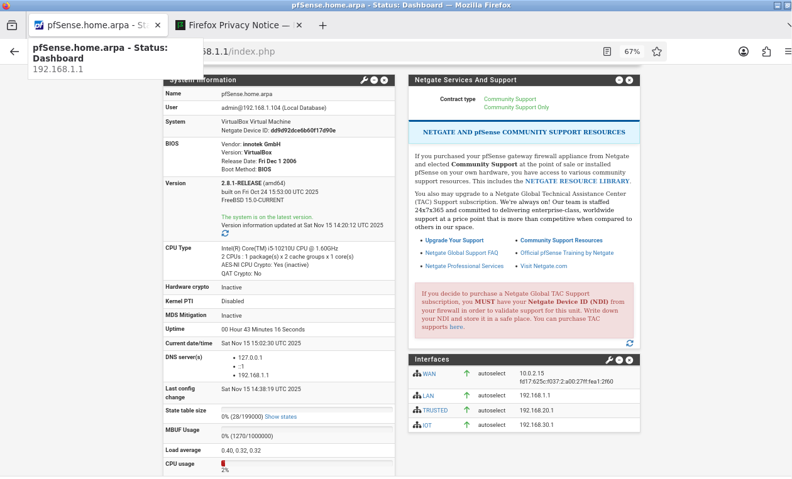
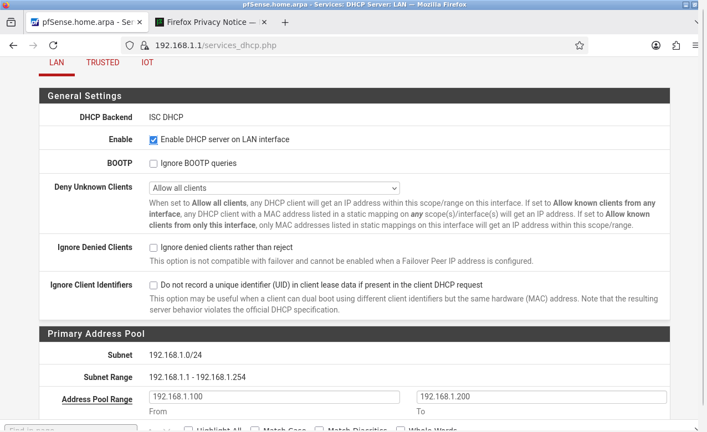
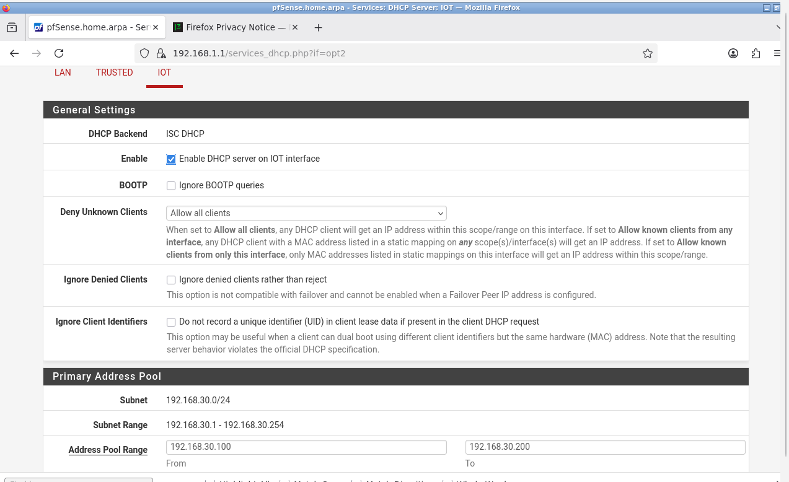
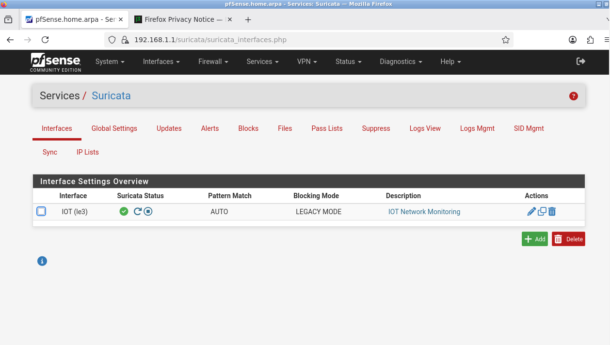
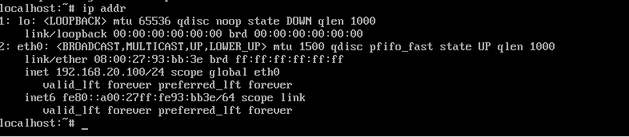
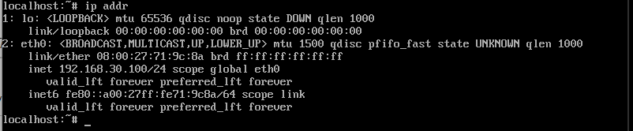

# Secure Home Network Architecture Lab
## Enterprise-Grade Network Segmentation Project

**Author:** Dipesh Koirala  
**Completion Date:** November 15, 2025  
**Project Duration:** 2 days  
**Status:**  Complete

---

##  Executive Summary

This project demonstrates the design and implementation of a segmented network architecture using enterprise security principles. The lab environment simulates a multi-zone network with proper isolation, firewall controls, and intrusion detection, all built using virtualization technology at zero cost.

**Bottom Line:** Successfully implemented network segmentation that prevents compromised IoT devices from accessing trusted systems, while maintaining full internet connectivity and administrative oversight.

---

##  Skills Demonstrated

### Technical Skills
- Network segmentation and VLAN design
- Firewall configuration and rule management
- Virtual network architecture
- DHCP service deployment
- Intrusion Detection System (IDS) implementation
- Defense-in-depth security strategy
- System administration (BSD/Linux)
- Command-line interface proficiency
- Troubleshooting and problem-solving

### Security Concepts
- Lateral movement prevention
- Principle of least privilege
- Attack surface reduction
- Blast radius containment
- Zero-trust network design

---

##  Architecture Overview

### Network Segments

The lab implements three distinct security zones:

| Zone | Network | IP Range | Security Level | Purpose |
|------|---------|----------|----------------|---------|
| **Management** | 192.168.1.0/24 | .100-.200 | HIGHEST | Network administration |
| **Trusted** | 192.168.20.0/24 | .100-.200 | HIGH | Personal devices |
| **IoT** | 192.168.30.0/24 | .100-.200 | RESTRICTED | Smart devices (isolated) |

### Security Policies

**Management Network (LAN):**
- Full access to all network resources
- Can manage and configure all devices
- Administrative oversight and monitoring

**Trusted Network:**
- Unrestricted internet access
- Can initiate connections to IoT network (for device management)
- Cannot be accessed by IoT devices

**IoT Network:**
- Internet access only (WAN)
- **BLOCKED** from accessing Trusted network
- **BLOCKED** from accessing Management network
- Complete isolation for threat containment

---

##  Visual Documentation

### System Overview


*Complete lab environment showing all virtual machines*

### Network Configuration


*pfSense interface assignments: WAN, LAN (Management), TRUSTED, and IOT networks*


*System dashboard showing all interfaces operational with proper IP addressing*

### DHCP Configuration


*Management network DHCP: 192.168.1.100-200*


*Trusted network DHCP: 192.168.20.100-200*


*IoT network DHCP: 192.168.30.100-200*

### Firewall Rules


*Trusted network allows internet access with full connectivity*


*Critical security rule: IoT devices BLOCKED from Trusted network, internet-only access*

### Intrusion Detection System


*Suricata IDS actively monitoring IoT network for threats*

### Network Isolation Testing


*Trusted test client successfully connected at 192.168.20.100*


*IoT test client successfully connected at 192.168.30.100*

**Isolation Verified:** IoT device at 192.168.30.100 **CANNOT** ping Trusted device at 192.168.20.100 (returns "Network unreachable")

---

##  Technology Stack

### Infrastructure
- **Virtualization:** Oracle VirtualBox 7.x
- **Firewall/Router:** pfSense CE (Community Edition) - FreeBSD-based
- **Admin Workstation:** Debian 12 with minimal GUI (Openbox + Firefox)
- **Test Clients:** Alpine Linux (lightweight, <50MB)

### Security Tools
- **IDS/IPS:** Suricata with ET Open ruleset
- **Firewall:** Stateful packet inspection with custom rules
- **Network Isolation:** Internal network segmentation

### Why This Stack?
- **Zero cost:** All open-source software
- **Industry-standard:** pfSense used in enterprise environments
- **Resource-efficient:** Runs on 8GB RAM laptop
- **Real-world applicable:** Same tools used in production networks

---

##  Implementation Details

### Phase 1: Core Infrastructure (Day 1)

**pfSense Deployment:**
- Created virtual machine with 2GB RAM, 2 CPUs
- Configured 4 network adapters (WAN + 3 internal networks)
- Resolved 64-bit CPU support issues through proper OS type configuration
- Assigned WAN (NAT) and LAN interfaces

**Challenges Encountered:**
- Initial "CPU doesn't support long mode" error
- **Solution:** Changed VM OS type from "Other/Unknown" to "FreeBSD (64-bit)" and enabled PAE/NX

**Admin Workstation Deployment:**
- Attempted Ubuntu Desktop (too resource-intensive)
- Attempted Ubuntu Server (installer failures)
- **Final solution:** Debian with minimal GUI (Xorg + Openbox + Firefox)
- Successfully accessed pfSense web interface

### Phase 2: Network Configuration (Day 1-2)

**Interface Setup:**
- Created TRUSTED interface on le2 (192.168.20.1/24)
- Created IOT interface on le3 (192.168.30.1/24)
- Configured DHCP servers on all three networks

**Firewall Rules Implementation:**
1. **TRUSTED Network:** Allow all traffic to any destination
2. **IOT Network - Rule 1:** Block IOT → TRUSTED subnets (security isolation)
3. **IOT Network - Rule 2:** Allow IOT → WAN (internet access)

**Security Rationale:**
The firewall configuration implements defense-in-depth:
- **Least Privilege:** IoT devices only get what they need (internet)
- **Network Segmentation:** Each zone isolated by default
- **Controlled Access:** Management network maintains oversight
- **Threat Containment:** Compromised IoT device cannot pivot to trusted devices

### Phase 3: Testing & Validation (Day 2)

**Client VM Deployment:**
- Created TRUSTED-Test VM connected to VLAN20-Trusted
- Created IOT-Test VM connected to VLAN30-IoT
- Both received DHCP assignments correctly

**Connectivity Testing:**
-  TRUSTED VM: Internet access working
-  IOT VM: Internet access working
-  TRUSTED VM → IoT VM: Connection successful
-  **IOT VM → TRUSTED VM: BLOCKED (Network unreachable)**

**Result:** Network isolation successfully enforced by firewall rules.

### Phase 4: Security Monitoring (Day 2)

**Suricata IDS Deployment:**
- Installed Suricata package on pfSense
- Configured to monitor IOT interface
- Downloaded ET Open (Emerging Threats) ruleset
- Enabled blocking mode (IPS functionality)
- Verified active monitoring status

---

##  Security Architecture

### Threat Model

**Scenario:** IoT device (smart camera, smart TV) is compromised by attacker

**Without Segmentation:**
```
[Attacker] → [Compromised IoT Device] → [All Home Devices]
                                      → [Laptops with sensitive data]
                                      → [Personal files]
                                      → [Banking information]
```

**With This Implementation:**
```
[Attacker] → [Compromised IoT Device] →  BLOCKED by Firewall
              └─> Internet Only         
```

### Defense Layers

1. **Network Segmentation:** Physical separation via VLANs
2. **Stateful Firewall:** Inspects and controls all traffic between zones
3. **Explicit Deny Rules:** Default-deny posture for inter-VLAN communication
4. **Intrusion Detection:** Monitors for malicious patterns
5. **Least Privilege:** Each network gets minimum required access

---

##  Results & Metrics

### What Works
-  Complete network isolation between Trusted and IoT networks
-  All networks have functional internet connectivity
-  DHCP automatically assigns IPs to new devices
-  Firewall rules successfully enforce security policies
-  IDS actively monitoring untrusted network
-  Management network maintains full administrative access

### Performance
- System runs smoothly on 8GB RAM host
- pfSense: 2GB RAM, minimal CPU usage
- Test VMs: 512MB RAM each
- No noticeable latency in network operations

### Security Posture
- **Lateral Movement:** Prevented (IoT → Trusted blocked)
- **Attack Surface:** Reduced (IoT devices isolated)
- **Blast Radius:** Contained (compromised IoT can't reach critical systems)
- **Monitoring:** Active IDS on high-risk network
- **Administrative Control:** Full visibility and management capability

---

##  Key Learnings

### Technical Insights
1. **Virtualization nuances:** OS type settings critical for 64-bit guest support
2. **Resource management:** Minimal installations crucial for low-RAM environments
3. **Network troubleshooting:** Interface naming and VLAN tagging must match exactly
4. **Firewall rule ordering:** Rules processed top-to-bottom; order matters
5. **CSRF tokens:** Text-based browsers insufficient for modern web interfaces

### Security Concepts Reinforced
1. **Defense-in-depth:** Multiple layers provide redundancy
2. **Principle of least privilege:** Grant minimum necessary access
3. **Network segmentation:** Critical for containing threats
4. **Stateful inspection:** Firewall must track connection state
5. **Threat modeling:** Design security around realistic attack scenarios

### Problem-Solving Approach
1. **Systematic troubleshooting:** Check each layer (physical → logical → application)
2. **Resource constraints drive creativity:** Minimal installations when hardware limited
3. **Documentation importance:** Clear notes prevent repeated mistakes
4. **Iterative improvement:** Start simple, add complexity gradually

---

##  Future Enhancements

### Potential Additions
1. **Guest Network:** Add VLAN40 for visitor devices (internet-only)
2. **DMZ:** VLAN50 for publicly-accessible services
3. **VPN Access:** Secure remote access to management network
4. **Log Aggregation:** Centralized logging with ELK stack or Splunk
5. **Automated Testing:** Scripts to verify isolation after changes
6. **Certificate-based Auth:** 802.1X for device authentication
7. **Traffic Analysis:** ntopng or Zeek for deep packet inspection
8. **Penetration Testing:** Metasploit-based attack simulations

### Lessons for Next Project
- Start with SIEM/log analysis lab
- Incorporate more attack simulations
- Document throughout (not just at end)
- Create network diagrams first (visual planning helps)

---

##  Real-World Applications

### Home Network
- Isolate IoT devices from personal computers
- Protect smart home devices (cameras, thermostats, voice assistants)
- Secure guest WiFi access
- Safe environment for testing new devices

### Small Business
- Segment POS systems from corporate network
- Isolate IP cameras and security systems
- Separate guest WiFi from business resources
- Protect sensitive data from compromised endpoints

### Enterprise
- DMZ for public-facing web servers
- Separate development/staging/production environments
- Isolate OT/ICS networks from IT networks
- Contractor/vendor network segregation

---

##  References & Resources

### Documentation Used
- [pfSense Official Documentation](https://docs.netgate.com/pfsense/)
- [VirtualBox User Manual](https://www.virtualbox.org/manual/)
- [Suricata User Guide](https://docs.suricata.io/)
- [Debian Administrator's Handbook](https://debian-handbook.info/)

### Learning Resources
- Network segmentation best practices (NIST SP 800-125B)
- VLAN security guidelines (Cisco VLAN Security)
- Firewall rule design principles
- Defense-in-depth strategy (NSA/CISA guidelines)

### Similar Projects for Learning
- Build SIEM lab with Security Onion
- Home VPN server with WireGuard
- Honeypot deployment
- Blue team vs Red team CTF environment

---

##  Contact & Portfolio

**GitHub:** [github.com/dxkoirala/secure-home-network](https://github.com/dxkoirala/secure-home-network)  
**Email:** koiraladipesh65@gmail.com
---

##  License & Usage

This project documentation is provided for educational purposes. The network architecture and security principles can be freely adapted for:
- Personal learning and development
- Home network security improvements
- Lab environments for practice
- Portfolio demonstration for job applications

**Tools Used:**
- pfSense: Apache 2.0 License
- Debian: Free Software (multiple licenses)
- Suricata: GPLv2 License
- Alpine Linux: MIT-like license

---

##  Project Statistics

- **Duration:** 2 days (November 14-15, 2025)
- **Active Work Hours:** ~10 hours
- **Virtual Machines Created:** 4 (pfSense, Admin, 2 test clients)
- **Network Segments Configured:** 3
- **Firewall Rules Implemented:** 3
- **Issues Resolved:** 5 major troubleshooting challenges
- **Screenshots Documented:** 11
- **Lines of Configuration:** 100+
- **Cost:** $0 (all open-source)

---

*This project demonstrates practical cybersecurity skills through hands-on implementation of enterprise network security concepts. Built entirely with free, open-source tools on consumer hardware.*

**Project Status:  COMPLETE**
